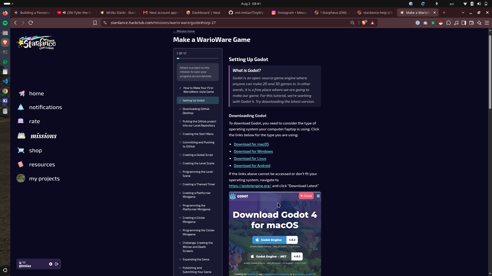
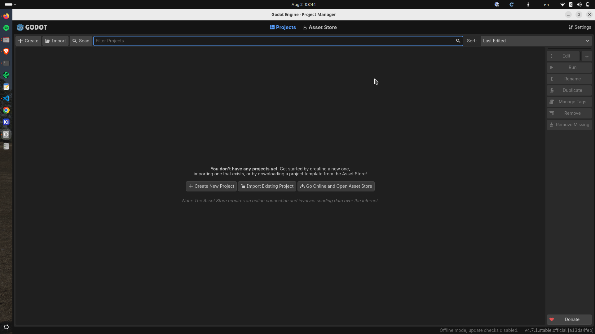
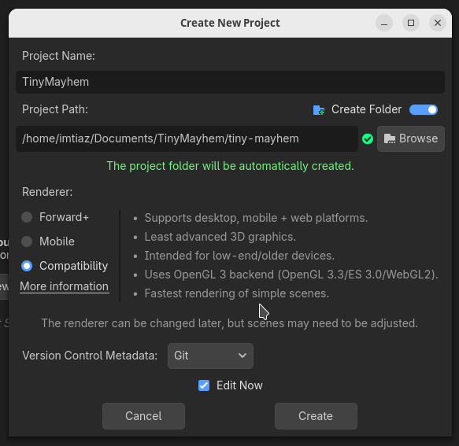
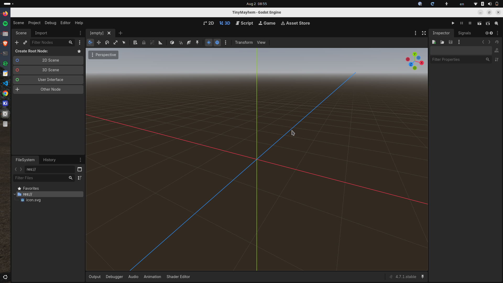
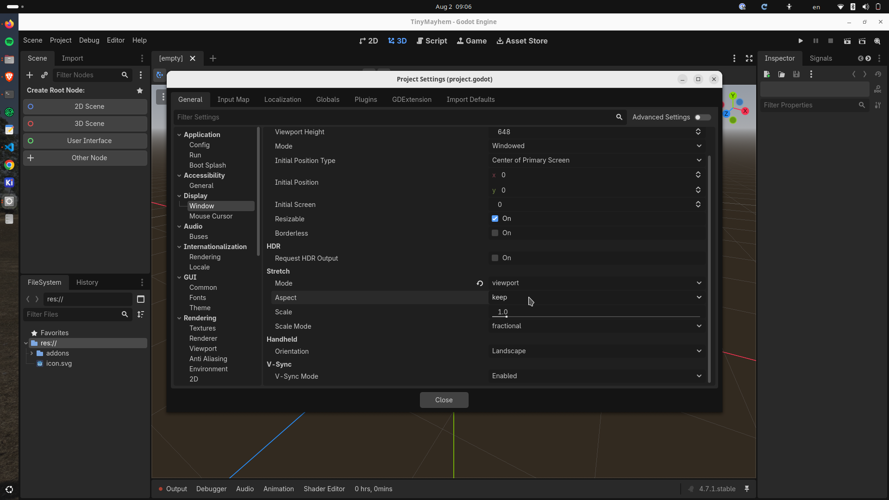
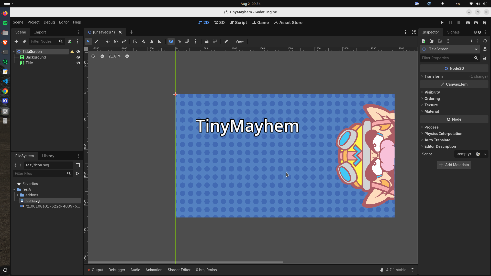

# Journey of TinyMayhem
Hey, It's me, Imtiaz, on another project.
In this, I'm gonna make my own WarioWare Game named TinyMayhem.

## Date: 2nd August, 2026
I basically have no idea about godots and games, im just here to experience the journey. So, firstly I created a repo for the game TinyMayhem. 

The concept of the game TinyMayhem will be like there will be a character named Mayhem. He has to cross some levels to win the game.

so, here i am in the provided guide by hack club-

ill basically install godot for linux, as i am currently in ubuntu.

i just downloaded and installed godot for linux and it's already here, wow.

As the 3rd step intends, im in linux so ig ima skip this one.

as it says, i went to Godot, fill the forms, chose compatibility.

AND IM IN AN ENGINE ALREADY. (im scared :3)

hey, it was so easy to setup. 
i had to install godot super wakatime and changed mode into viewport and aspect into keep. 

Then, started my real work. I took a 2D Screen node and named it "TitleScreen". Under it, I took a TextureRect node and named it "Background", got a WarioWare wallpaper from Internet and put it as the background. Then took a RichTextLabel node and named it "Title", under that Font-size: 300, Normal ticked off, Outline: 60, Title is "TinyMayhem".

Time to create a button!
